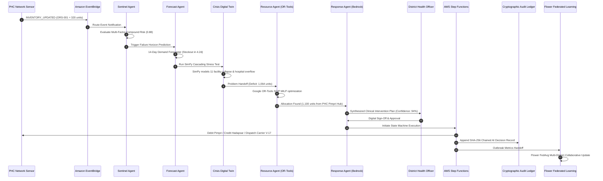
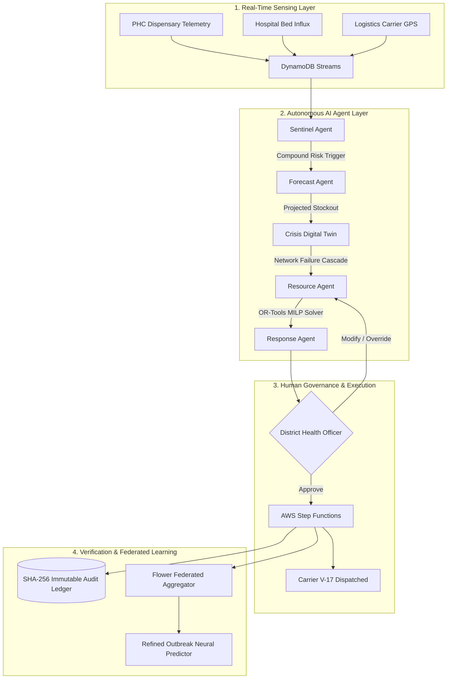
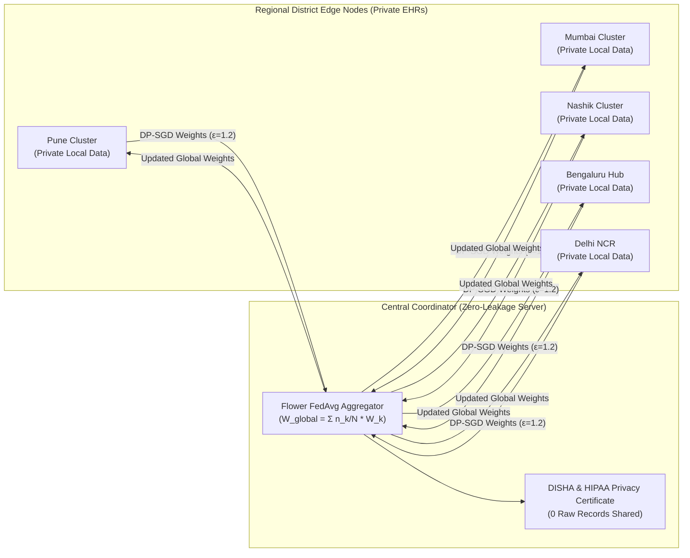

# RESILIA Production Architecture on AWS

## Enterprise Cloud Deployment Topology

```
                                      [ Internet / Health Officials ]
                                                     │
                                                     ▼
                                     ┌───────────────────────────────┐
                                     │     AWS Route 53 (DNS)        │
                                     │     AWS WAF (Threat Filter)   │
                                     └───────────────┬───────────────┘
                                                     │
                                                     ▼
                                     ┌───────────────────────────────┐
                                     │    Amazon API Gateway (HTTP)  │
                                     │   + Cognito JWT Authorizer    │
                                     └───────────────┬───────────────┘
                                                     │
                                                     ▼
                                     ┌───────────────────────────────┐
                                     │      AWS ALB (Load Balancer)  │
                                     └───────────────┬───────────────┘
                                                     │
                                     ┌───────────────┴───────────────┐
                                     ▼                               ▼
                      ┌─────────────────────────────┐ ┌─────────────────────────────┐
                      │    ECS Fargate: Backend     │ │    ECS Fargate: Dashboard   │
                      │   (FastAPI Microservices)   │ │    (Streamlit Command UI)   │
                      └──────────────┬──────────────┘ └─────────────────────────────┘
                                     │
           ┌─────────────────────────┼─────────────────────────┐
           ▼                         ▼                         ▼
┌─────────────────────┐   ┌─────────────────────┐   ┌─────────────────────┐
│   Amazon DynamoDB   │   │ Amazon EventBridge  │   │   Amazon Bedrock    │
│  - Resilia-PHCs     │   │ - ResiliaEventBus   │   │ - Claude 3.5 Sonnet │
│  - Resilia-Inventory│   │   (Reactive Pub/Sub)│   │   (Agent Reasoning) │
│  - Resilia-Audit    │   └──────────┬──────────┘   └─────────────────────┘
└─────────────────────┘              │
                                     ▼
                          ┌─────────────────────┐
                          │ AWS Step Functions  │
                          │ - ResiliaPipeline   │
                          │   (Execution Logic) │
                          └──────────┬──────────┘
                                     │
           ┌─────────────────────────┴─────────────────────────┐
           ▼                                                   ▼
┌─────────────────────┐                             ┌─────────────────────┐
│  Amazon OpenSearch  │                             │      Amazon S3      │
│  - Semantic Incident│                             │  - Model Weights    │
│    Search & Audit   │                             │  - Cold Archives    │
└─────────────────────┘                             └─────────────────────┘
```

## Core AWS Services Mapping

1. **Amazon Bedrock**:
   - Powers the autonomous agent layer (`SentinelAgent`, `ForecastAgent`, `CrisisAgent`, `ResourceAgent`, `ResponseAgent`).
   - Claude 3.5 Sonnet / Titan models generate clinical problem justifications, risk evaluations, and natural language scenario interpretations.

2. **Amazon DynamoDB**:
   - Zero-administration serverless key-value database hosting PHC registries, live medicine stocks, beds, staff, and audit records.
   - Global Secondary Indexes (`DistrictIndex`, `SequenceIndex`) enable single-digit millisecond query latency.

3. **Amazon EventBridge**:
   - Serverless event bus routing operational events (`PATIENT_SURGE`, `INVENTORY_ALERT`, `SUPPLIER_DELAY`, `INTERVENTION_APPROVED`).
   - Decouples monitoring agents from downstream execution pipelines.

4. **AWS Step Functions**:
   - Orchestrates multi-step distributed intervention workflows:
     `ValidateSurplus -> DebitSource -> CreditTarget -> DispatchCarrier -> EmitEventBridge -> WriteAuditRecord`.

5. **Amazon OpenSearch & S3**:
   - OpenSearch provides log analytics and semantic search across historical incident logs.
   - S3 provides encrypted immutable storage for federated model checkpoints and compliance archives.

6. **AWS Cognito & Verified Permissions (Cedar)**:
   - Manages user identity and fine-grained role-based access control:
     - `DistrictHealthOfficers`: Full intervention review and execution rights.
     - `PHCPharmacists`: Local telemetry ingestion and stock adjustments.
     - `NationalCommanders`: Platform-wide governance and national policy tuning.

---

## Agent Interaction Sequence Diagram



---

## Data-Flow Pipeline Diagram



---

## Federated Learning Architecture (Flower + DP-SGD)


